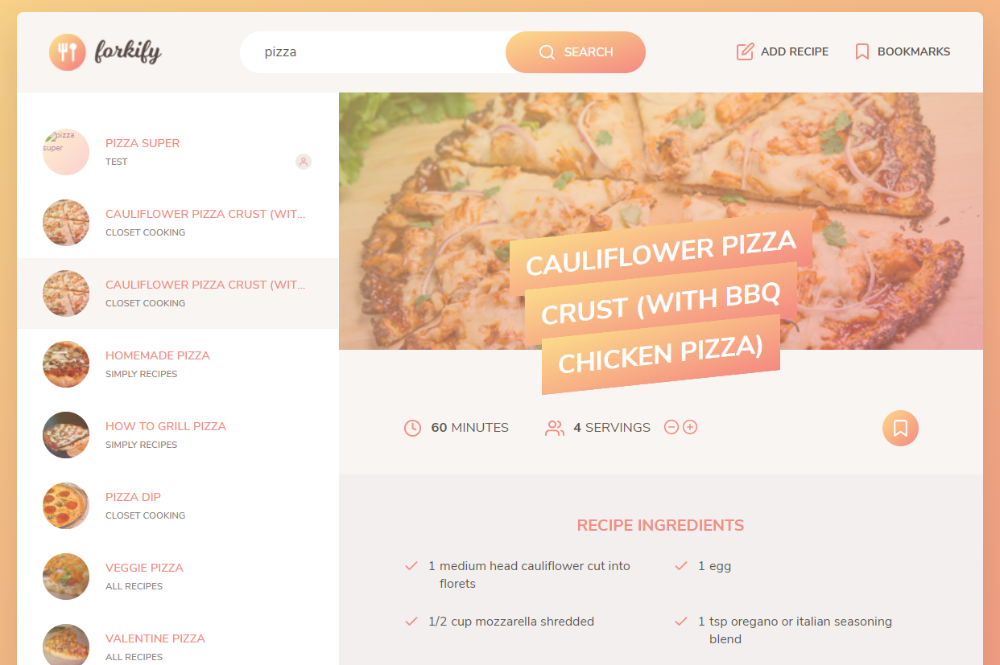

<h1 align="center">
  Forkify App
</h1>

<h3 align="center">
<strong>Project based on Udemy Course: The Complete JavaScript Course 2021: From Zero to Expert!e</strong>
</h3>

  
  
  
  
   
   
  <a href="#space_invader-technologies">Technologies</a>
   
   
  
   
  <a href="https://shiga-forkify.netlify.app/" target="_blank">
    <h3 align="center"><b>VISIT</b></h3>
  </a>
   

## :space_invader: Technologies

- HTML
- CSS / SASS
- Javascript
- Parcel
